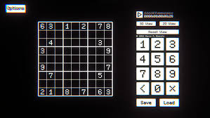

<h1 align="center">Proyecto Sudoku</h1>

  <a href="" rel="noopener">
 

<h1 align="center">Clase de Estructuras de Datos</h1>
<h3 align="center">Profesor: <a href="https://github.com/JuanS3">Sebastián Martínez</a></h3>

<h3 align="center">Alumno: <a href="https://github.com/condebufon">Andres Javier Martínez</a></h3>

---

 El Sudoku es un juego de lógica y razonamiento que consiste en rellenar una cuadrícula de 9x9
celdas (81 casillas) dividida en subcuadrículas de 3x3 (también llamadas “cajas” o “regiones”)
con los números del 1 al 9, sin repetir ningún número dentro de la fila, columna o cuadrado
     

## 📝 Requisitos

- [Requisitos funcionales](#requisito_1)
- [Requisitos no funcionales](#requisito_2)
- [Fases del desarrollo](#desarrollo)
- [Authors](#authors)

## 🧐 Requisitos funcionales 

* Una cuadrícula de 9x9 celdas (81 casillas) dividida en subcuadrículas de 3x3
* Una plataforma o dispositivo compatible, como una PC con sistema operativo
Windows 10, 11.
* Fácil de aprender, con una curva de aprendizaje suave, tambien Diferentes niveles de dificultad para adaptarse a las habilidades del jugador
* La capacidad de marcar o borrar números en las casillas, capacidad de mostrar solo números posibles
* La posibilidad de verificar si la solución es correcta o no 
* La capacidad de guardar y cargar partidas

## 🧐 Requisitos no funcionales 
Estos requisitos describen cómo debe funcionar el sistema. En este caso, los requisitos no funcionales incluyen: 

* El sistema debe ser implementado en un lenguaje de programación de elección del estudiante.
* El código debe estar documentado.
* El proyecto debe ser entregado en un plazo de 2-3 semanas.

## 🏁 Fases del desarrollo 

El proyecto se puede dividir en las siguientes fases:

* Fase 1: Levantamiento de requerimientos: En esta fase, los estudiantes deben entender las necesidades del cliente para poder desarrollar una solución que satisfaga esas necesidades.
* Fase 2: Diseño: En esta fase, los estudiantes deben diseñar la solución que satisfaga los requisitos del cliente.
* Fase 3: Implementación: En esta fase, los estudiantes deben implementar la solución.
* Fase 4: Pruebas: En esta fase, los estudiantes deben probar la solución para asegurarse de que cumple con los requisitos.
* Fase 5: Entrega: En esta fase, los estudiantes deben entregar la solución al cliente.

## ✍️ Authors 

- [@condebufon](https>//github.com/condebufon) - modificaciones e interpretaciones